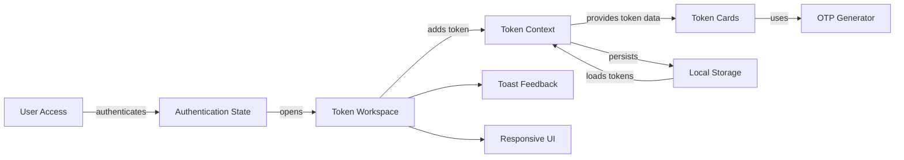
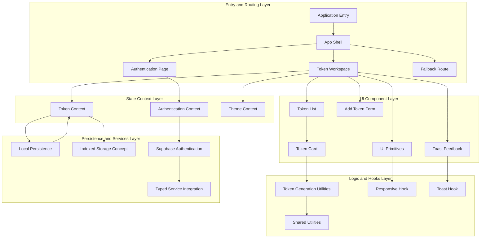
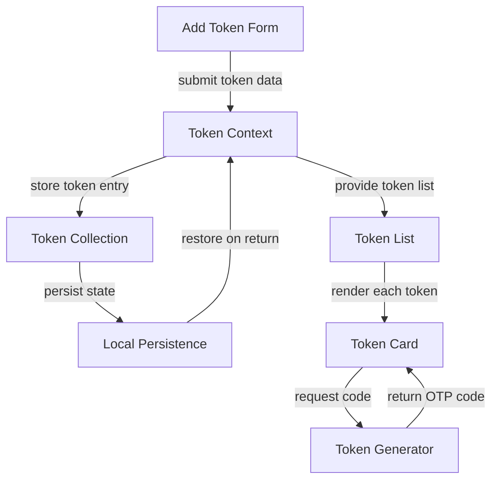
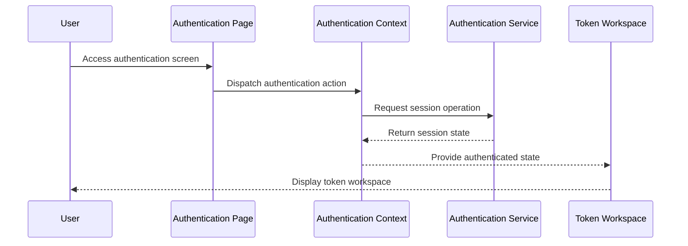
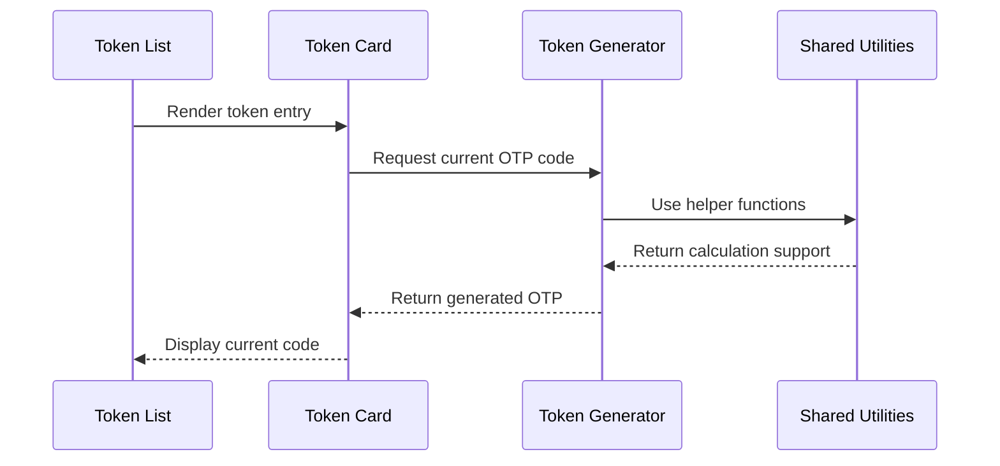

# AdiNox

  <strong>Secure OTP Authenticator and Token Management Application for two factor authentication workflows, local token persistence, Supabase authentication, responsive UI, and modular frontend state architecture.</strong>

  
  
  
  
  

---

## Overview

AdiNox is a secure authenticator and token management application designed for managing one time password tokens through a clean, responsive, and privacy focused interface.

The project focuses on the complete authenticator workflow: user access, authentication state, token creation, token listing, OTP code generation, local persistence, theme management, notification feedback, responsive behavior, and reusable UI architecture.

AdiNox is not only a simple OTP generator. The application is structured as a maintainable security focused frontend product where routing, UI components, authentication context, token context, token generation utilities, local storage persistence, custom hooks, and external authentication services are separated into clear responsibilities.

---

## Project Vision

The vision behind AdiNox is to create a lightweight but serious authenticator experience that is easy to use, easy to extend, and organized around clean frontend architecture.

Authenticator applications need to be fast, reliable, and understandable. Users need immediate access to token codes, simple token management actions, responsive behavior across devices, and persistent token availability across sessions. AdiNox approaches this through a modular structure where token UI, token state, token generation logic, authentication state, and persistence workflows remain separated.

The project is built around four major ideas:

- Make OTP token management simple and accessible
- Separate token generation logic from visual components
- Keep authentication state and token state independent
- Use reusable UI, hooks, and context patterns for maintainability

---

## Core Capabilities

### OTP Token Management

AdiNox provides a user interface for adding, viewing, and managing authentication tokens. The token workflow is designed around practical use, allowing users to organize authentication entries and access generated codes from a focused workspace.

### Token Code Generation

The token generation logic is separated into utility functions, keeping OTP calculation concerns away from the interface. This makes the codebase easier to reason about and supports future changes to token generation behavior.

### Authentication State

AdiNox includes an authentication context that manages user session state and connects authenticated access with the application experience.

### Token State Management

Token data is managed through a dedicated token context. This helps organize token add, delete, update, read, and provide operations through a consistent state layer.

### Theme State

The application includes theme state support, allowing visual preferences to remain separate from token and authentication state.

### Local Persistence

AdiNox includes a local persistence workflow where token data can be maintained through browser storage concepts. This allows token state to remain available across sessions while keeping token operations organized through the frontend state layer.

### Responsive Interface

The application includes responsive behavior hooks and reusable UI primitives to support a clean authenticator experience across different screen sizes.

### Notification Feedback

Toast based feedback supports user clarity during token related actions, authentication state changes, and interface events.

---

## Product Workflow

AdiNox follows a structured authenticator workflow.

1. The user accesses the authenticator workspace.
2. Authentication state determines the available application experience.
3. The user adds or manages OTP token entries.
4. Token context stores the current collection of token data.
5. Token generation utilities generate OTP codes for token cards.
6. Token cards display generated codes in the interface.
7. Token data persists through local browser storage concepts.
8. Responsive hooks and UI primitives keep the experience consistent.

---

## Architecture Philosophy

AdiNox follows a layered frontend architecture where each concern has a dedicated role.

### Entry and Routing Layer

The entry and routing layer handles the application bootstrap, page routing, authentication page access, main workspace, and fallback route behavior.

### UI Component Layer

The UI component layer contains token lists, add token forms, token cards, reusable UI primitives, and notification components. This keeps the visual system organized into reusable pieces.

### State Context Layer

The state context layer manages authentication state, token state, and theme state. Separating these contexts helps prevent unrelated responsibilities from becoming tightly coupled.

### Logic and Hooks Layer

The logic and hooks layer contains token generation utilities, shared utility functions, responsive behavior hooks, and toast notification hooks. This keeps behavior reusable and testable.

### Persistence and Services Layer

The persistence and service layer handles local token persistence concepts and external authentication support. This layer connects application state with storage and user session services.

---

## Token Management Flow

The main product behavior of AdiNox is token management. The flow begins when a token is added and continues through state storage, local persistence, OTP generation, and UI rendering.

---

## Authentication Flow

AdiNox includes authentication awareness through a dedicated authentication context. This allows the application to manage user access separately from token state.

---

## OTP Generation Sequence

---

## System Areas

### Application Shell

The application shell organizes routing, page structure, protected areas, and the main user experience.

### Authentication Page

The authentication page handles user access and connects login actions with the authentication context.

### Token Workspace

The token workspace is the main area where users view and manage authentication token entries.

### Token List

The token list displays stored authentication entries and provides a structured view of available tokens.

### Add Token Form

The add token form allows users to create new token entries and submit those entries into token state.

### Token Card

The token card displays a generated OTP code and related token information.

### Authentication Context

The authentication context manages session state and keeps authentication concerns separate from token management.

### Token Context

The token context manages token data, token actions, and token persistence workflows.

### Theme Context

The theme context manages visual preference state and keeps theme logic isolated from authentication and token logic.

### Token Utilities

Token utilities handle OTP generation and token related helper behavior.

### Custom Hooks

Custom hooks support responsive UI behavior and toast notifications.

### Local Persistence

Local persistence supports token state continuity across sessions.

### Supabase Authentication

Supabase authentication supports external user session handling.

---

## Practical Use Cases

AdiNox can support several authentication and security related workflows:

- Two factor authentication token management
- OTP code generation
- Authenticator style application interface
- Local token persistence
- Secure frontend state management
- User session handling
- Responsive authentication tooling
- Token card based UI workflows
- Security focused frontend product foundations
- Reusable component based authenticator architecture

---

## Engineering Highlights

- Modular authenticator application architecture
- Separated authentication, token, and theme state
- Dedicated OTP generation utilities
- Local persistence workflow
- Supabase authentication support
- Reusable token components
- Responsive behavior hooks
- Toast notification feedback
- Clean page and routing structure
- Maintainable UI primitives
- Security focused frontend design

---

## Security and Data Handling

AdiNox is designed around authentication workflows and token style data. A system like AdiNox should treat token handling, local persistence, authentication state, user access, and storage behavior as important engineering concerns.

Sensitive credentials, private endpoints, service tokens, environment specific details, and operational configuration should not be exposed in public documentation or committed to a public repository.

---

## Performance Considerations

AdiNox includes architecture choices that support maintainability and user experience:

- Token generation logic remains separate from UI components.
- Token state is centralized in a dedicated context.
- Authentication state remains isolated from token state.
- Reusable UI primitives reduce repeated interface code.
- Local persistence allows session continuity.
- Responsive hooks improve usability across device sizes.
- Notification hooks keep feedback behavior reusable.

---

## Roadmap

### Product Evolution

- Improved token organization
- Search and filtering for token entries
- Token grouping concepts
- Backup and restore workflow concepts
- Stronger token metadata support
- Improved token card interactions

### Security Evolution

- Enhanced local protection concepts
- Encrypted persistence strategy
- Safer token import and export flows
- Advanced session awareness
- Recovery and migration workflows

### Interface Evolution

- More theme options
- Advanced responsive layouts
- Improved toast feedback
- Better empty states
- Token action menus
- More polished dashboard interactions

---

## Project Positioning

AdiNox demonstrates the intersection of frontend architecture, authentication workflows, OTP token logic, local persistence, reusable UI components, and security focused application design.

The project is structured as a practical authenticator foundation where routing, token UI, token state, authentication state, OTP generation, local storage, hooks, notifications, and Supabase authentication are connected into one maintainable system.

---

## Author

**Adil Munawar**  
Web Developer, SaaS Architect, and Project Lead at Nexus Orbits Pakistan

- Portfolio: `https://adilmunawar.vercel.app`
- GitHub: `https://github.com/adilmunawar`
- LinkedIn: `https://pk.linkedin.com/in/adilmunawar`

---

  <strong>AdiNox</strong> 
  Secure OTP authenticator and token management application.

